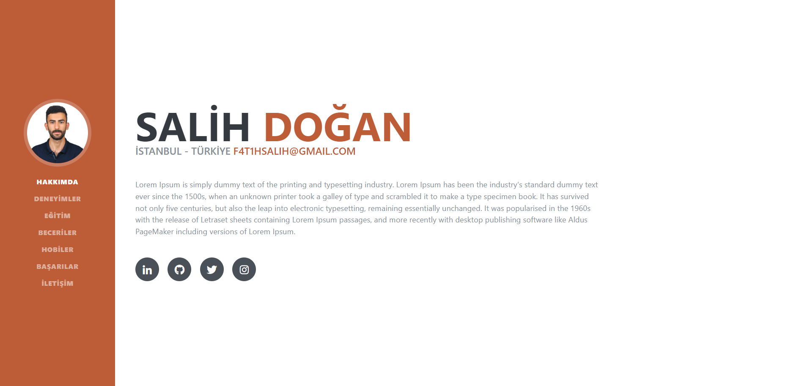
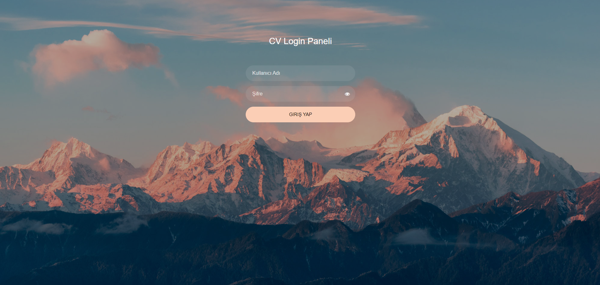
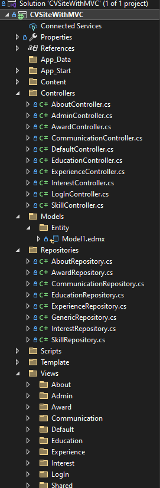
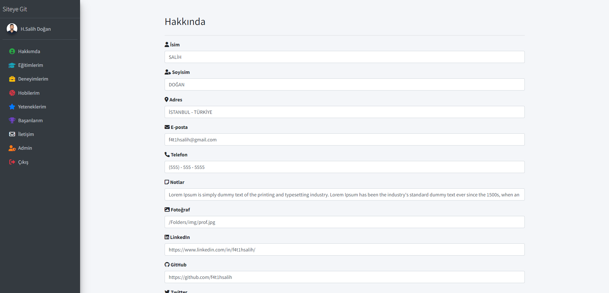
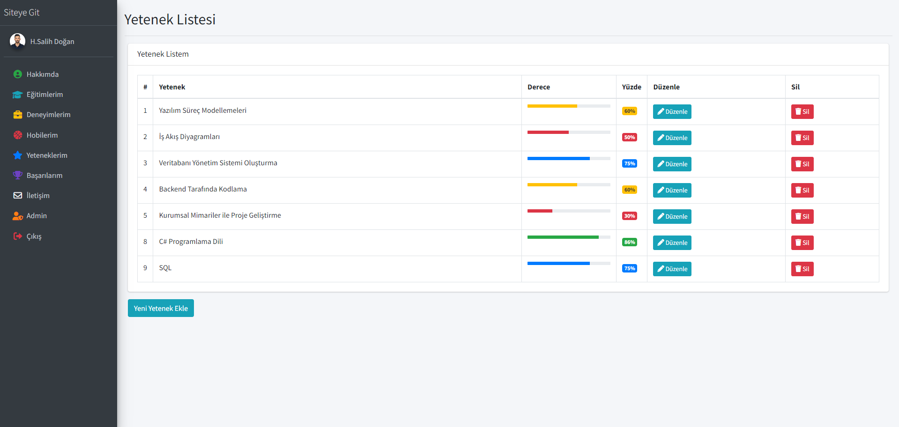
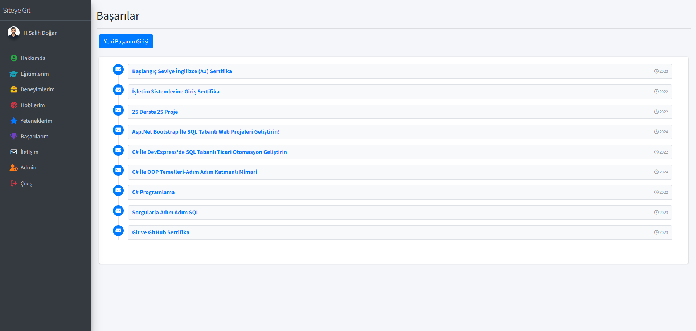
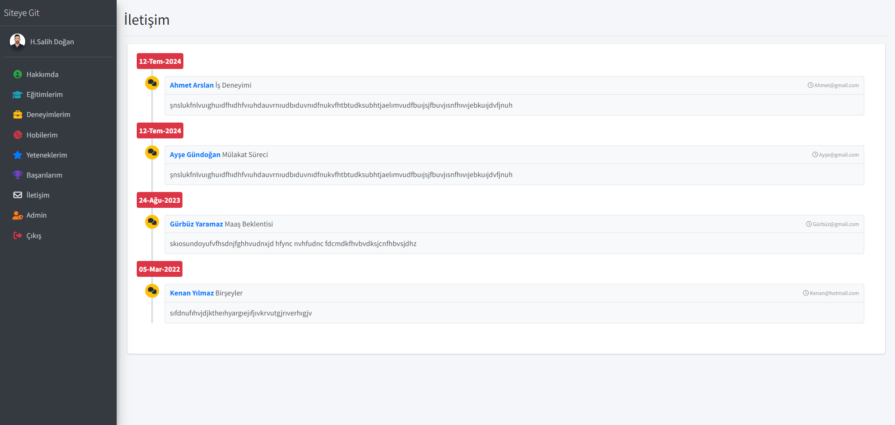
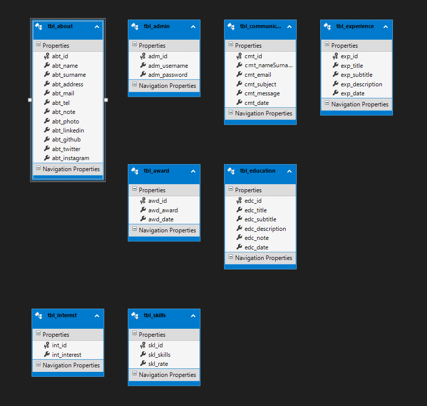

# Mvc5 ile Sıfırdan Admin Panelli Dinamik CV Sitesi

## Proje Hakkında

Bu proje, modern web uygulamaları geliştirmek için MVC (Model-View-Controller) mimarisi kullanılarak tasarlanmıştır. Proje, yönetici ve kullanıcı deneyimlerini optimize etmek amacıyla iki ana bölümden oluşmaktadır:

1. **Admin Paneli:** Yöneticilerin site içeriğini kolayca yönetebilmesi, kullanıcıları ve bölümleri düzenleyebilmesi için kapsamlı bir kontrol paneli sunmaktadır. Bu panel üzerinden siteye yeni içerikler eklenebilir, mevcut içerikler güncellenebilir ve kullanıcı etkinlikleri takip edilebilir.

2. **Kullanıcıya Görünür Site:** Kullanıcılar için şık ve kullanıcı dostu bir arayüzle sunulan bu bölümde, ziyaretçiler projeye ait tüm bilgilere kolayca erişebilir. 

Proje, ziyaretçilerin kendilerini tanıtabileceği ve yeteneklerini sergileyebileceği altı ana bölüm içermektedir:
- **Hakkında:** Kişisel bilgiler ve tanıtım.
- **Eğitimler:** Alınan eğitimler ve akademik geçmiş.
- **Deneyimler:** Profesyonel iş deneyimleri ve kariyer geçmişi.
- **Hobiler:** Kişisel ilgi alanları ve hobiler.
- **Yetenekler:** Teknik beceriler ve uzmanlık alanları.
- **Başarılar:** Kazanılan ödüller ve elde edilen başarılar.

Bu proje, hem yöneticiler hem de kullanıcılar için işlevsel, verimli ve estetik açıdan tatmin edici bir deneyim sunmayı hedeflemektedir.

## Proje Resimleri
Aşağıda projeye ait bazı ekran görüntüleri bulunmaktadır:

